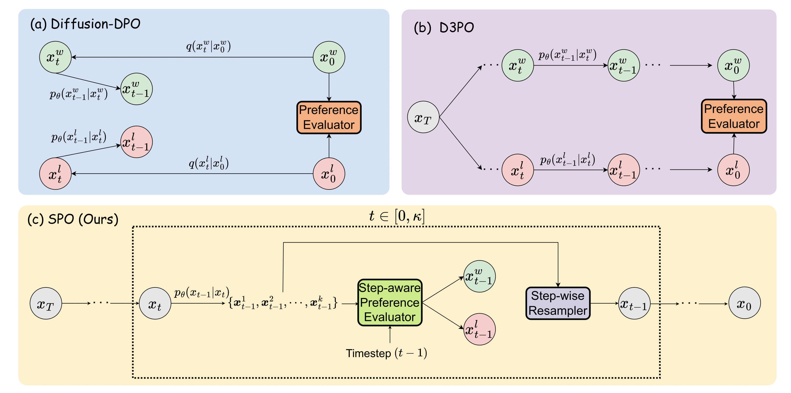
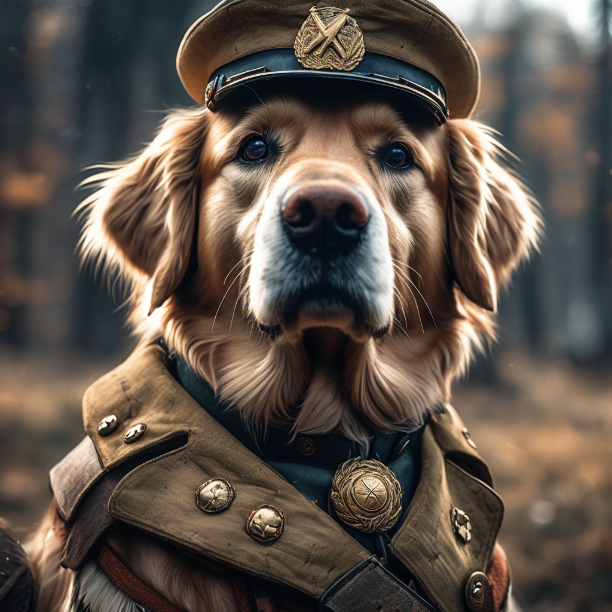
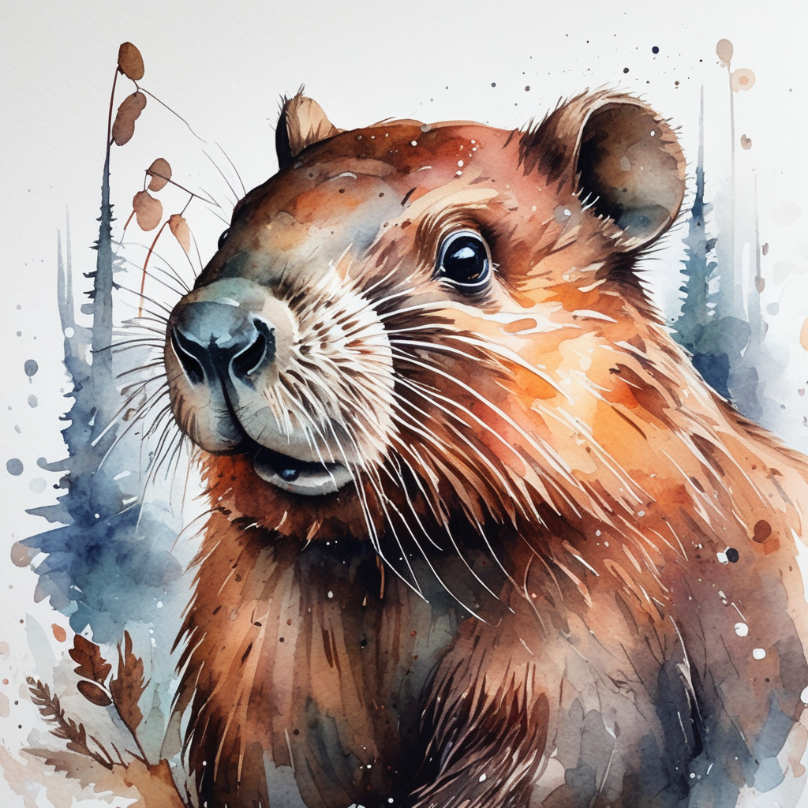
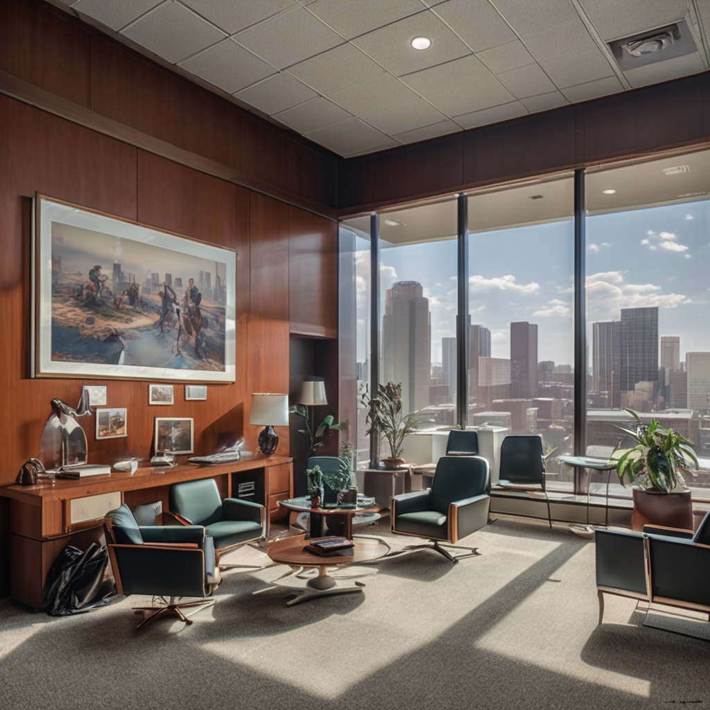

# Step-aware Preference Optimization: Aligning Preference with Denoising Performance at Each Step
 [Zhanhao Liang](https://github.com/RockeyCoss), [Yuhui Yuan](https://www.microsoft.com/en-us/research/people/yuyua/), [Shuyang Gu](https://cientgu.github.io), [Bohan Chen](https://github.com/BHCHENGIT), [Tiankai Hang](https://tiankaihang.github.io/), [Ji Li](https://sites.google.com/a/usc.edu/jili/), [Liang Zheng](https://zheng-lab.cecs.anu.edu.au)
 
<a href="https://arxiv.org/abs/2406.04314"></a>
<a href="https://rockeycoss.github.io/spo.github.io/"></a>
<a href="https://huggingface.co/SPO-Diffusion-Models"></a>


This is the official implementation of SPO, introduced in [Step-aware Preference Optimization: Aligning Preference with Denoising Performance at Each Step]().

## News
**2024.07.10** Release the training code of SPO.

**2024.06.20** Release the SD v1.5 checkpoint and inference code.

**2024.06.07** Release the SDXL checkpoint and inference code. 


## Abstract
<p>
Recently, Direct Preference Optimization (DPO) has extended its success from aligning large language models (LLMs) to aligning text-to-image diffusion models with human preferences.
Unlike most existing DPO methods that assume all diffusion steps share a consistent preference order with the final generated images, we argue that this assumption neglects step-specific denoising performance and that preference labels should be tailored to each step's contribution.
</p>
<p> 
To address this limitation, we propose Step-aware Preference Optimization (SPO), a novel post-training approach that independently evaluates and adjusts the denoising performance at each step, using a <em>step-aware preference model</em> and a <em>step-wise resampler</em> to ensure accurate step-aware supervision.
Specifically, at each denoising step, we sample a pool of images, find a suitable win-lose pair, and, most importantly, randomly select a single image from the pool to initialize the next denoising step. This step-wise resampler process ensures the next win-lose image pair comes from the same image, making the win-lose comparison independent of the previous step. To assess the preferences at each step, we train a separate step-aware preference model that can be applied to both noisy and clean images.
</p> 
<p>
Our experiments with Stable Diffusion v1.5 and SDXL demonstrate that SPO significantly outperforms the latest Diffusion-DPO in aligning generated images with complex, detailed prompts and enhancing aesthetics, while also achieving more than 20&times; times faster in training efficiency. Code and model: https://rockeycoss.github.io/spo.github.io/
</p>

## Method Overview


## TODO
- [x] Release training code
- [x] Release checkpoints and inference code
- [x] Initialization

## Gallery
<table>
  <tr>
    <td></td>
    <td></td>
    <td></td>
    <td></td>
  </tr>
  <tr>
    <td></td>
    <td></td>
    <td></td>
    <td></td>
  </tr>
  <tr>
    <td></td>
    <td></td>
    <td></td>
    <td></td>
  </tr>
  <tr>
    <td></td>
    <td></td>
    <td></td>
    <td></td>
  </tr>
  <tr>
    <td></td>
    <td></td>
    <td></td>
    <td></td>
  </tr>
</table>

## :wrench: Installation
1. Pull the Docker Image
```bash
sudo docker pull rockeycoss/spo:v1
```
2. Login to wandb
```bash
wandb login {Your wandb key}
```
3. (Optional) To customize the location for saving models downloaded from Hugging Face, you can use the following command:
```bash
export HUGGING_FACE_CACHE_DIR=/path/to/your/cache/dir
```

## :wrench: Inference Hugging Face Checkpoints

SDXL inference
```bash
PYTHONPATH=$(pwd) python inference_scripts/inference_spo_sdxl.py
```

SD v1.5 inference
```bash
PYTHONPATH=$(pwd) python inference_scripts/inference_spo_sd-v1-5.py
```

## :wrench: Training
The following scripts assume the use of four 80GB A100 GPUs for fine-tuning, as described in the [paper](https://arxiv.org/abs/2406.04314).

Before fine-tuning, please download the checkpoints of step-aware preference models. You can do this by following these steps:
```bash
sudo apt update
sudo apt install wget

mkdir model_ckpts
cd model_ckpts

wget https://huggingface.co/SPO-Diffusion-Models/Step-Aware_Preference_Models/resolve/main/sd-v1-5_step-aware_preference_model.bin

wget https://huggingface.co/SPO-Diffusion-Models/Step-Aware_Preference_Models/resolve/main/sdxl_step-aware_preference_model.bin

cd ..
```

To fine-tune SD v1.5, you can use the following command:
```bash
PYTHONPATH=$(pwd) accelerate launch --config_file accelerate_cfg/1m4g_fp16.yaml train_scripts/train_spo.py --config configs/spo_sd-v1-5_4k-prompts_num-sam-4_10ep_bs10.py
```
To fine-tune SDXL, you can use the following command:
```bash
PYTHONPATH=$(pwd) accelerate launch --config_file accelerate_cfg/1m4g_fp16.yaml train_scripts/train_spo_sdxl.py --config configs/spo_sdxl_4k-prompts_num-sam-2_3-is_10ep_bs2_gradacc2.py
```

## :unlock: Available Checkpoints

[SPO-SDXL_4k-prompts_10-epochs](https://huggingface.co/SPO-Diffusion-Models/SPO-SDXL_4k-p_10ep)

[SPO-SDXL_4k-prompts_10-epochs_LoRA](https://huggingface.co/SPO-Diffusion-Models/SPO-SDXL_4k-p_10ep_LoRA)

[SPO-SD-v1-5_4k-prompts_10-epochs](https://huggingface.co/SPO-Diffusion-Models/SPO-SD-v1-5_4k-p_10ep)

[SPO-SD-v1-5_4k-prompts_10-epochs_LoRA](https://huggingface.co/SPO-Diffusion-Models/SPO-SD-v1-5_4k-p_10ep_LoRA)

## Acknowledgement
Our codebase references the code from [Diffusers](https://github.com/huggingface/diffusers), [D3PO](https://github.com/yk7333/d3po) and [PickScore](https://github.com/yuvalkirstain/PickScore). We extend our gratitude to their authors for open-sourcing their code.

## :mailbox_with_mail: Citation
If you find this code useful in your research, please consider citing:

```
@article{liang2024step,
  title={Step-aware Preference Optimization: Aligning Preference with Denoising Performance at Each Step},
  author={Liang, Zhanhao and Yuan, Yuhui and Gu, Shuyang and Chen, Bohan and Hang, Tiankai and Li, Ji and Zheng, Liang},
  journal={arXiv preprint arXiv:2406.04314},
  year={2024}
}
```
